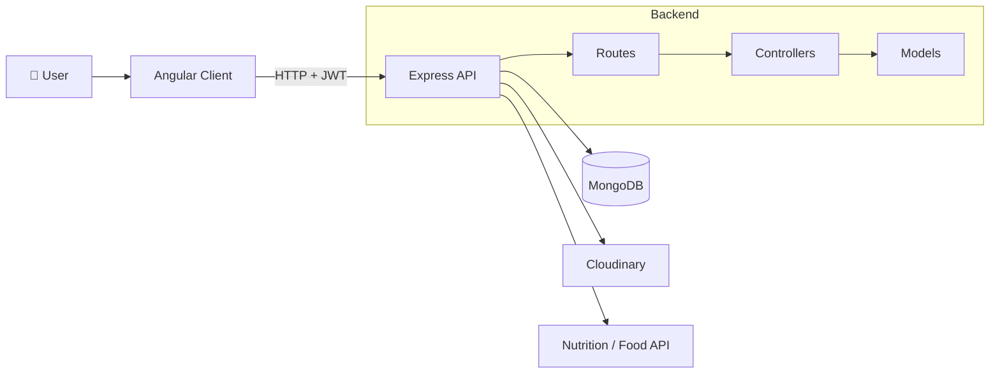

<div align="center">

# 🥗 DEIT Tracker

### A full-stack diet, calorie & fitness tracker built on the MEAN stack

Log meals, track activity, set goals and watch your progress with clean charts — all in one sky-blue dashboard.

[](https://deittracker.vercel.app/dashboard)


**[🌐 Live Demo](https://deittracker.vercel.app/dashboard)** · **[🐞 Report Bug](../../issues)** · **[✨ Request Feature](../../issues)**

</div>

---

## 📑 Table of Contents

- [About the Project](#-about-the-project)
- [Key Features](#-key-features)
- [Tech Stack](#-tech-stack)
- [System Architecture](#-system-architecture)
- [Project Structure](#-project-structure)
- [Getting Started](#-getting-started)
- [Environment Variables](#-environment-variables)
- [API Reference](#-api-reference)
- [Screenshots](#-screenshots)
- [Testing](#-testing)
- [Deployment](#-deployment)
- [Roadmap](#-roadmap)
- [Contributing](#-contributing)
- [Author](#-author)

---

## 📖 About the Project

**DEIT Tracker** helps people take control of their nutrition and fitness. Instead of juggling spreadsheets and guesswork, users can search foods, log meals with automatic calorie calculation, record workouts, set a weight goal and see exactly how their **net calories** (`intake − burned`) trend over time.

**Why it stands out**

- 🔎 Food search backed by an external nutrition API – no manual calorie lookup
- 📊 Weekly & monthly reports that turn raw logs into visual insight
- 🔐 Secure by design – JWT auth, hashed passwords, protected routes
- 🌗 Polished UX – responsive layout with dark / light theme

---

## ✨ Key Features

| Area | What you get |
|---|---|
| 🔐 **Authentication** | Register / login with JWT, password hashing, protected routes and route guards |
| 🏠 **Dashboard** | Calories consumed, calories burned, net calories and goal progress at a glance |
| 🍽️ **Meal Logging** | Breakfast, lunch, dinner & snacks · auto calorie calculation · edit / delete · history |
| 🔎 **Food Search** | Search foods and add them to a meal in a click |
| 🏃 **Activity Tracking** | Log workouts and calories burned |
| 🎯 **Goal Tracking** | Set weight-gain or weight-loss goals and monitor progress |
| 📈 **Reports** | Weekly and monthly charts of intake vs. burn |
| 👤 **Profile** | Update personal details and upload a profile picture (Cloudinary) |
| 🌗 **Theming** | Dark / light mode with persisted preference |
| 📱 **Responsive** | Works across mobile, tablet and desktop |

---

## 🛠 Tech Stack

**Frontend**
- Angular 20 + TypeScript
- CSS3 (custom sky-blue design system)
- Angular Router, HttpClient, RxJS

**Backend**
- Node.js + Express.js (REST API)
- MongoDB + Mongoose
- JSON Web Tokens (JWT) + bcrypt
- Cloudinary (image uploads)

**Tooling & Deployment**
- Postman / Thunder Client for API testing
- Karma + Jasmine for Angular unit tests
- Vercel (frontend) · Render (backend)
- Git & GitHub

---

## 🏗 System Architecture



**Request flow:** Angular service → REST call with `Authorization: Bearer <token>` → Express route → auth middleware → controller → Mongoose model → JSON response → component renders UI.

---

## 📂 Project Structure

```bash
DEIT-Tracker/
├── backend/
│   ├── config/
│   │   ├── cloudinary.js        # Cloudinary setup
│   │   └── mongodb.js           # DB connection
│   ├── controller/
│   │   ├── foodController.js
│   │   ├── goalTrackingController.js
│   │   ├── reportController.js
│   │   ├── uploadController.js
│   │   └── usercontroller.js
│   ├── model/                   # Mongoose schemas
│   │   ├── goaltrackingmodel.js # Goal tracking schema
│   │   ├── user.js              # User schema
│   │   └── userFoodModel.js     # Meal / food log schema
│   ├── routes/
│   │   ├── foodRoutes.js
│   │   ├── goalTrackingRoutes.js
│   │   ├── reportRoutes.js
│   │   └── userRoute.js
│   ├── server.js                # App entry point
│   └── package.json
│
├── client/
│   ├── public/
│   │   └── _redirects           # SPA redirect rules
│   └── src/
│       ├── app/
│       │   ├── add-activity/
│       │   ├── dashboard/
│       │   ├── food-search/
│       │   ├── goal-tracking/
│       │   ├── login/
│       │   ├── profile/
│       │   ├── report/
│       │   ├── header/ · footer/ · navigation-bar/
│       │   ├── services/        # auth, dark-mode, goal-tracking, report
│       │   ├── app.routes.ts
│       │   └── app.config.ts
│       ├── assets/
│       ├── environments/
│       └── main.ts
│
└── README.md
```

---

## 🚀 Getting Started

### Prerequisites

- [Node.js](https://nodejs.org/) v18+ and npm
- [MongoDB](https://www.mongodb.com/) (local or Atlas)
- A [Cloudinary](https://cloudinary.com/) account
- Angular CLI → `npm install -g @angular/cli`

### 1️⃣ Clone the repository

```bash
git clone https://github.com/<your-username>/<your-repo>.git
cd <your-repo>
```

### 2️⃣ Set up the backend

```bash
cd backend
npm install
cp .env.example .env     # then fill in your values (see below)
npm start                # or: npm run dev
```

The API runs on `http://localhost:5000` (or the port you set).

### 3️⃣ Set up the frontend

```bash
cd client
npm install
ng serve
```

Open **http://localhost:4200** 🎉

---

## 🔑 Environment Variables

Create `backend/.env`:

```env
PORT=5000
MONGODB_URI=mongodb+srv://<user>:<password>@<cluster>/<db>
JWT_SECRET=your_super_secret_key
JWT_EXPIRES_IN=7d

CLOUDINARY_CLOUD_NAME=your_cloud_name
CLOUDINARY_API_KEY=your_api_key
CLOUDINARY_API_SECRET=your_api_secret

FOOD_API_KEY=your_nutrition_api_key
```

> ⚠️ Never commit your `.env` file. Add an `.env.example` with empty values instead.

Point the Angular app at your API in `client/src/environments/`:

```ts
export const environment = {
  production: false,
  apiUrl: 'http://localhost:5000/api'
};
```

---

## 📡 API Reference

> Base URL: `/api` · 🔒 = requires `Authorization: Bearer <token>`
> *(Update paths to match your route files.)*

### Auth & User

| Method | Endpoint | Description | Auth |
|---|---|---|---|
| POST | `/user/register` | Create a new account | ❌ |
| POST | `/user/login` | Login and receive JWT | ❌ |
| GET | `/user/profile` | Get current user profile | 🔒 |
| PUT | `/user/profile` | Update profile details | 🔒 |
| POST | `/upload` | Upload profile picture | 🔒 |

### Food & Activity

| Method | Endpoint | Description | Auth |
|---|---|---|---|
| GET | `/food/search?query=` | Search foods via nutrition API | 🔒 |
| POST | `/food` | Log a meal / food entry | 🔒 |
| GET | `/food` | Get meal history | 🔒 |
| PUT | `/food/:id` | Edit an entry | 🔒 |
| DELETE | `/food/:id` | Delete an entry | 🔒 |

### Goals & Reports

| Method | Endpoint | Description | Auth |
|---|---|---|---|
| POST | `/goals` | Set a weight goal | 🔒 |
| GET | `/goals` | Get goal and progress | 🔒 |
| GET | `/reports/weekly` | Weekly summary | 🔒 |
| GET | `/reports/monthly` | Monthly summary | 🔒 |

**Sample login request**

```json
POST /api/user/login
{
  "email": "user@example.com",
  "password": "yourPassword"
}
```

**Sample response**

```json
{
  "success": true,
  "token": "eyJhbGciOiJIUzI1NiIs...",
  "user": { "id": "665f...", "name": "John Doe" }
}
```


## 🧪 Testing

```bash
# Frontend unit tests (Karma + Jasmine)
cd client
ng test

# Backend: test endpoints with Postman / Thunder Client
```

---

## ☁️ Deployment

| Layer | Platform |
|---|---|
| Frontend | [Vercel](https://vercel.com/) – `https://deittracker.vercel.app` |
| Backend | Render (set all env vars in the dashboard) |
| Database | MongoDB Atlas |
| Media | Cloudinary |

**Build the frontend**

```bash
cd client
ng build
```

The `public/_redirects` file ensures client-side routes work after refresh.

---

## 🗺 Roadmap

- [x] JWT authentication & protected routes
- [x] Meal logging with auto calories
- [x] Activity & goal tracking
- [x] Weekly / monthly reports
- [x] Dark / light theme
- [ ] Macro tracking (protein, carbs, fat)
- [ ] Water intake tracker
- [ ] AI-powered meal suggestions
- [ ] Barcode scanning
- [ ] PWA / offline support
- [ ] Export reports as PDF

---

## 🤝 Contributing

Contributions are welcome!

1. Fork the repo
2. Create a branch → `git checkout -b feature/amazing-feature`
3. Commit → `git commit -m "feat: add amazing feature"`
4. Push → `git push origin feature/amazing-feature`
5. Open a Pull Request

---

## 👨‍💻 Author

**Your Name**
B.Tech CSE · Dr. Ambedkar Institute of Technology for Divyangjan, Kanpur

[](https://github.com/Tausif289/deitapp)
[](https://www.linkedin.com/feed/update/urn:li:activity:7389855110211944449/)

---

<div align="center">

⭐ If you found this project useful, please give it a star!

</div>
